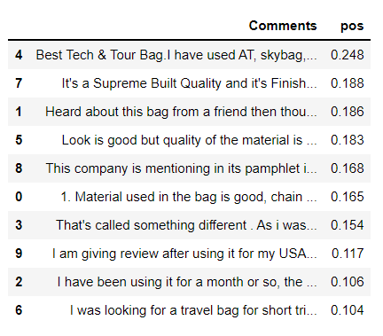

# Amazon-Review-Scrapping-and-Emotion-Mining
Amazon product reviews scrapping and emotion mining.

Reviews are an important part of buying products, when buying something the consumer looks at the ratings and reviews of the product this project focuses on the reviews of a product on Amazon. - GODS Ghost 22 Litre Anti-Theft 15.6 Inch Laptop Backpack (Carbon Fibre Colour)
By using python libraries we rate the emotions of the reviews in positive and negative categories.

Technologies used - Python, Jupyter Notebook, Pandas, Numpy, Matplotlib, URL.Lib, Beautiful Soup.

### Amazon Reviews WordCloud

### Amazon Reviews ranked with emotion mining

### Amazon product positive reviews 

### Amazon product negative reviews

